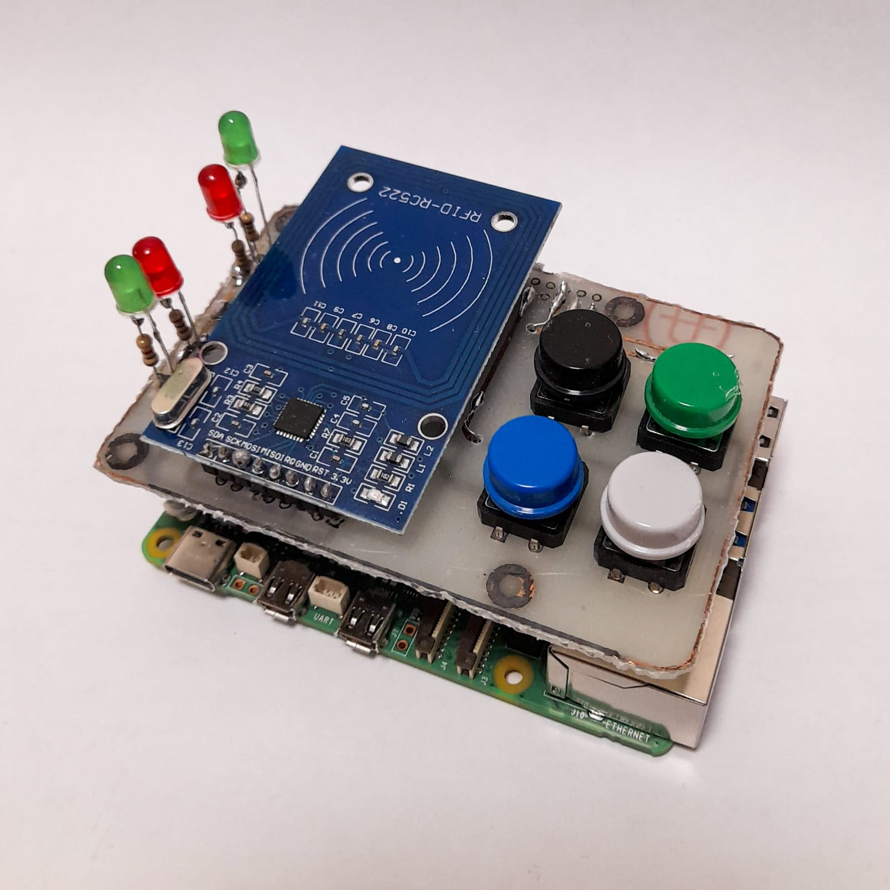
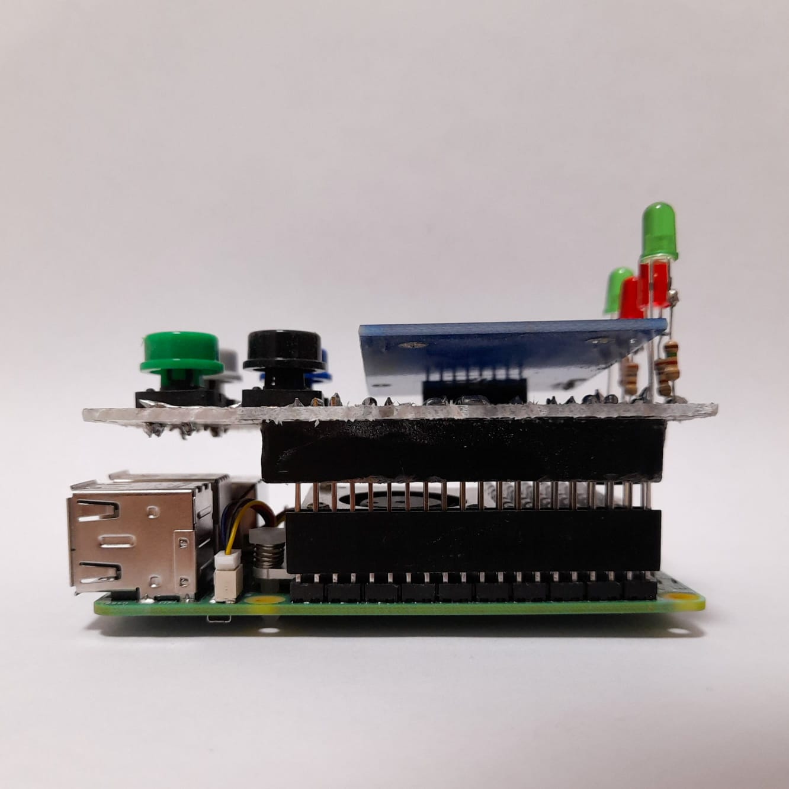
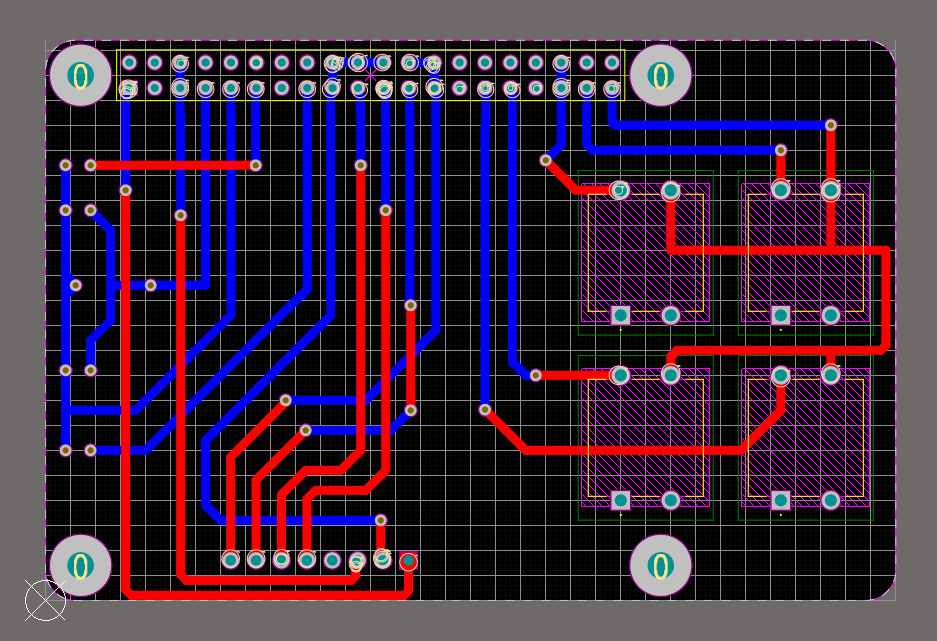
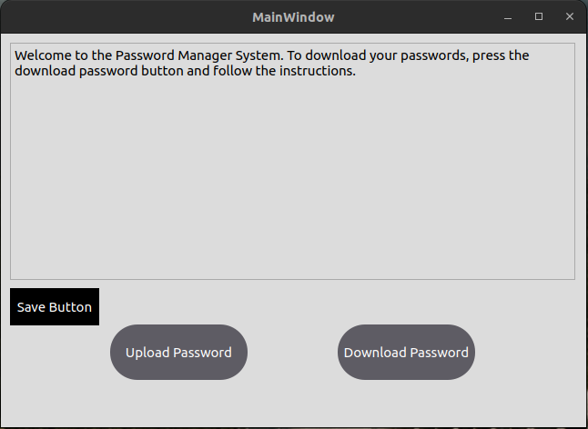

# Password Manager System

## Project Overview

The Password Manager System is a hardware-supported password management system developed as a proof of concept for the Engineering Design 1 course at university. This project aims to demonstrate the concept of secure password storage and management in today's digital world where we use numerous applications and systems daily.
The system implements a basic two-factor authentication mechanism using RFID cards and PIN codes to showcase how authorized access can be controlled. While this project is not intended to provide a completely secure solution for real-world implementation, it serves as an educational prototype to explore the challenges and approaches in password management security.

With the increasing number of applications and systems we use in daily life, secure storage of passwords has become a significant challenge. This project was developed to demonstrate a potential approach to this problem within the scope of an academic engineering design course.

<p float="left">
  
  
</p>

## Features

- RFID-based authentication
- PIN code as second-factor authentication
- Password storage in Firebase database
- Secure system running on Raspberry Pi 5
- Secure data transmission to desktop application via MQTT protocol
- User-friendly interface
- System status indication with LEDs

## System Architecture

The Password Manager System consists of the following components:

1. **Hardware Components**:
   - Raspberry Pi 5
   - RFID Card Reader (MFRC522)
   - 4 Physical Buttons (for PIN entry)
   - 4 LEDs (RFID, PIN, and 2 Error LEDs)
   - Buzzer
   - Custom Designed Printed Circuit Board (PCB)

2. **Software Components**:
   - RFID Reader Module (C++)
   - PIN Reader Module (Python)
   - Password Manager Pubnode (Python)
   - Password Manager Subnode (Python)
   - Desktop Application (C++/Qt)

3. **Data Storage**:
   - Firebase Realtime Database
   - Local JSON files

4. **Communication Protocols**:
   - MQTT (Device-to-device communication)
   - SPI (RFID reader communication)
   - GPIO (Button and LED control)


## PCB Design

In this project, a custom-designed printed circuit board (PCB) was used to ensure secure and organized connection of components. The PCB design enhances the reliability and professionalism of the system.

The PCB includes:
- Raspberry Pi connection pins
- RFID card reader integration
- 4 physical buttons
- 4 LED indicators (RFID, PIN, and 2 Error LEDs)
- Buzzer
- Required resistors



## Working Principle

1. The user presses the "Download Password" button in the desktop application to retrieve their passwords.
2. The system prompts the user to scan their RFID card.
3. The RFID card reader reads the card UID and transmits it to the system via MQTT.
4. The system verifies the RFID authentication and provides feedback with an LED.
5. The user enters a 4-digit PIN code using the physical buttons.
6. The system verifies the PIN authentication and provides feedback with an LED.
7. If two-factor authentication is successful, the user's passwords are retrieved from Firebase and sent to the desktop application.
8. The user can view, edit, and upload their passwords back to Firebase using the "Upload Password" button.


## User Interface

The desktop application provides a clean and user-friendly interface for users to easily manage their passwords.



## Technologies and Programming Languages

- **Raspberry Pi Side**:
  - Python: For PIN reader, Firebase integration, and MQTT communication
  - C++: For RFID card reader
  - GPIO: For button and LED control
  - SPI: For RFID reader communication

- **Desktop Application**:
  - C++: For application logic
  - Qt Framework: For user interface
  - MQTT: For communication with Raspberry Pi
  - OpenSSL: For secure communication

- **Database**:
  - Firebase Realtime Database: For cloud storage of passwords
  - JSON: For local data storage format

## Installation

### Requirements

#### Hardware
- Raspberry Pi 5
- RFID Card Reader (MFRC522)
- 4 Physical Buttons
- 4 LEDs (RFID, PIN, and 2 Error LEDs)
- Buzzer
- Custom Designed Printed Circuit Board (PCB)

#### Software
- Raspberry Pi OS
- Python 3.x
- C++ Compiler
- Qt Creator 5.15.2 or higher
- Firebase Account

### Raspberry Pi Setup

1. Install the required libraries on Raspberry Pi:
   ```bash
   pip install paho-mqtt firebase-admin gpiozero
   ```

2. Enable SPI interface for RFID reader:
   ```bash
   sudo raspi-config
   ```
   > Interfacing Options > SPI > Yes

3. Upload Firebase service account credentials (JSON) to Raspberry Pi.

4. Copy project files to Raspberry Pi.

### Desktop Application Setup

1. Install Qt Creator.

2. Install required Qt modules:
   - Qt Widgets
   - Qt MQTT
   - OpenSSL

3. Open and compile the project files.

## File Structure

### Raspberry Pi Side
- `Button_Manager.py`: PIN code reading and MQTT sending system
- `Password_Manager_pubnode.py`: RFID and PIN-based authentication system
- `Password_Manager_subnode.py`: Firebase and MQTT data synchronization system
- `rfid_reader.cpp`: RFID card reader module

### Desktop Application
- `main.cpp`: Main application launcher
- `mainwindow.cpp/h`: Main window and application logic
- `mainwindow.ui`: User interface design
- `CMakeLists.txt`: Compilation configuration

## Security Features

- Two-factor authentication (RFID + PIN)
- Firebase authentication
- Data integrity checks
- Secure communication with OpenSSL

## MQTT Topics

- `rfid`: Carries RFID card UID
- `pin`: Carries PIN code
- `pc-to-rpi-flag`: Flag messages from PC to Raspberry Pi
- `pc-to-rpi-data`: JSON data from PC to Raspberry Pi
- `rpi-to-pc-data`: JSON data from Raspberry Pi to PC
- `rpi-to-pc-flag`: Flag messages from Raspberry Pi to PC


## Project Results

The project has been successfully completed and achieved the following goals:
- Secure password storage
- Two-factor authentication
- User-friendly interface
- Reliable hardware integration

